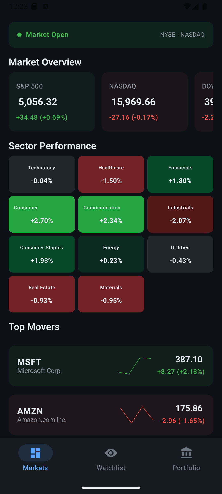
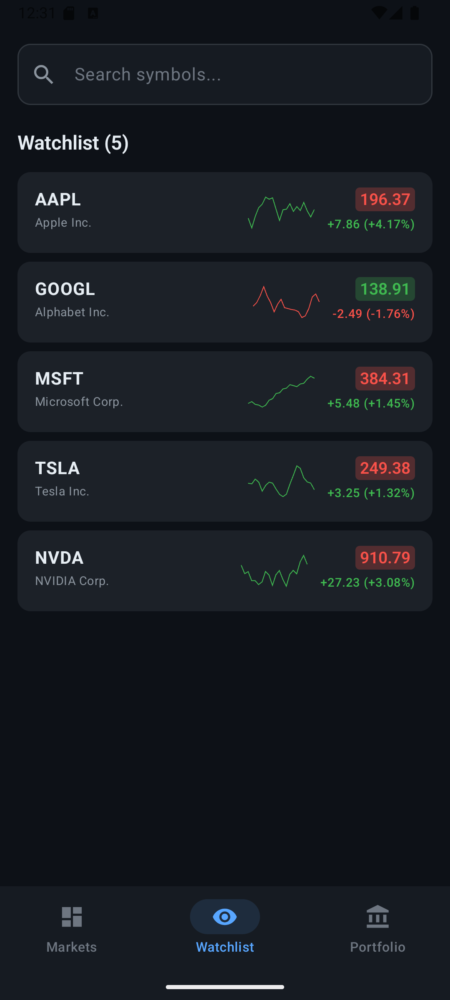
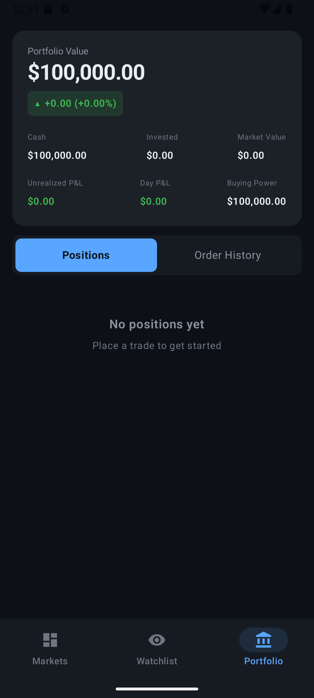
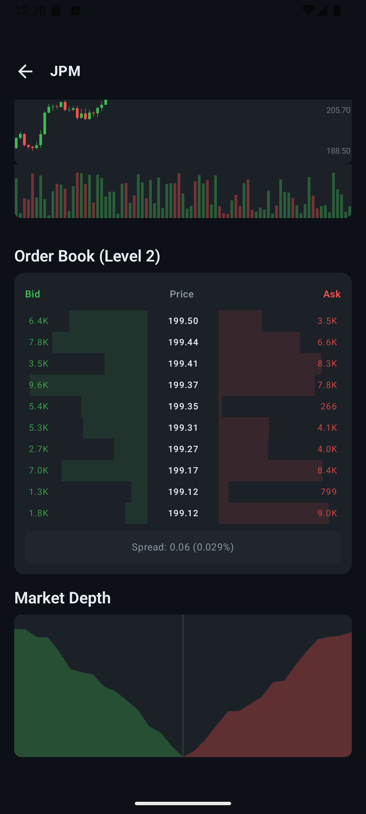
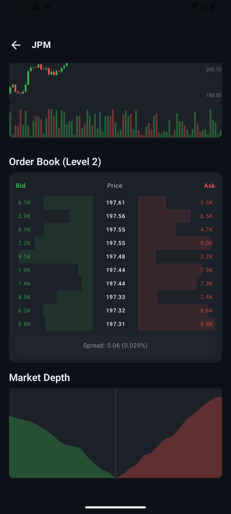
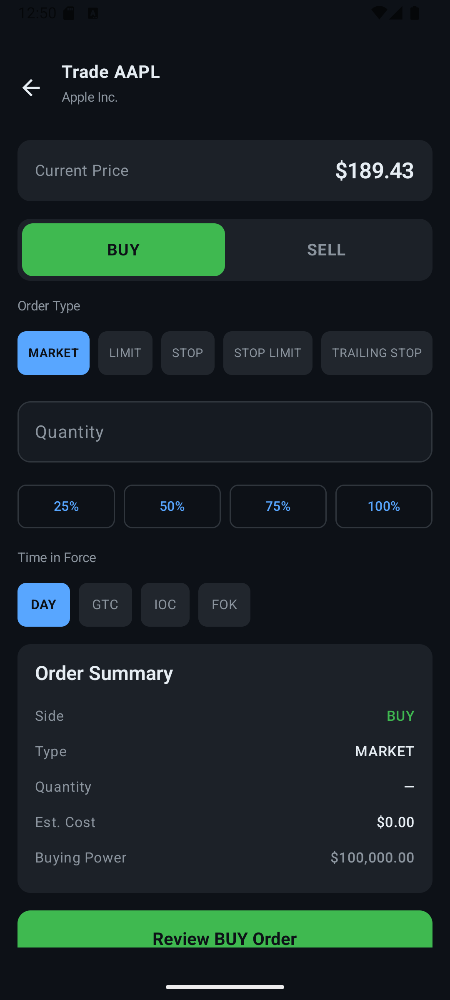
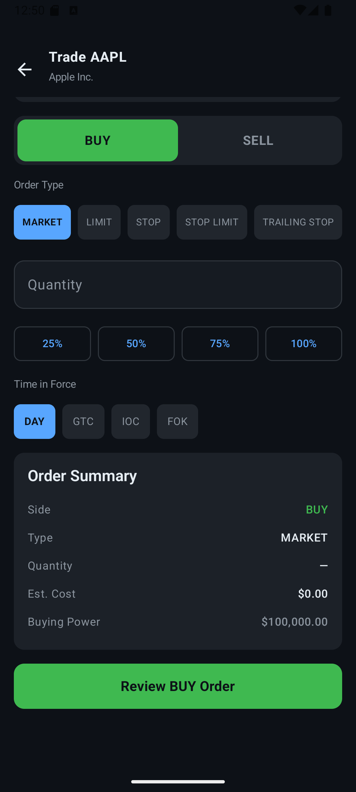

# Android Trading App POC

A production-style Android trading terminal POC that demonstrates modern mobile app engineering for trading workflows: live price streaming, charting, watchlists, order entry, and portfolio tracking.

## What this project is

This project is built to showcase:
- Strong Android architecture and implementation quality
- Real-time market UI behavior and trading UX patterns
- End-to-end flow from market data to order placement and portfolio impact

## Screenshots

### Dashboard

### Watchlist

### Portfolio

### Stock Detail (Chart)

### Stock Detail (Order Book & Depth)

### Order Entry (Top)

### Order Entry (Summary)

## Video

<video controls width="360" src="screenshots/demo.mp4">
   Your browser or Markdown preview does not support embedded video.
</video>

[Open video directly](screenshots/demo.mp4)

## What’s in here

- **Dashboard**: market indices, sector heatmap, top movers
- **Watchlist**: tracked symbols with realtime pricing and sparkline behavior
- **Stock Detail**: chart, order book, depth visualization
- **Order Entry**: market/limit/stop/stop-limit/trailing-stop flows with validation
- **Portfolio**: holdings, buying power, P&L, order history

## Tech Stack

- Kotlin
- Jetpack Compose + Material 3
- MVVM + Clean Architecture
- Coroutines + Flow
- Hilt (DI)
- Retrofit + OkHttp/WebSocket
- Room
- JUnit + Turbine

## Download / Setup / Run

### Prerequisites
- Android Studio (latest stable)
- JDK 17
- Android SDK + Emulator (or physical device)

### Steps
1. Clone the repository.
2. Open the project in Android Studio (or VS Code with Android tooling).
3. Start an emulator.
4. Build debug APK:
   - `./gradlew.bat assembleDebug`
5. Install on emulator/device:
   - `./gradlew.bat installDebug`
6. Run unit tests:
   - `./gradlew.bat testDebugUnitTest`

## Data Modes

- `SIMULATED` (default): offline demo-safe market simulation
- `LIVE`: Finnhub-backed live data
- `HYBRID`: live-first with simulator fallback

For live data, configure your Finnhub API key in the network module and switch mode in data source config.
